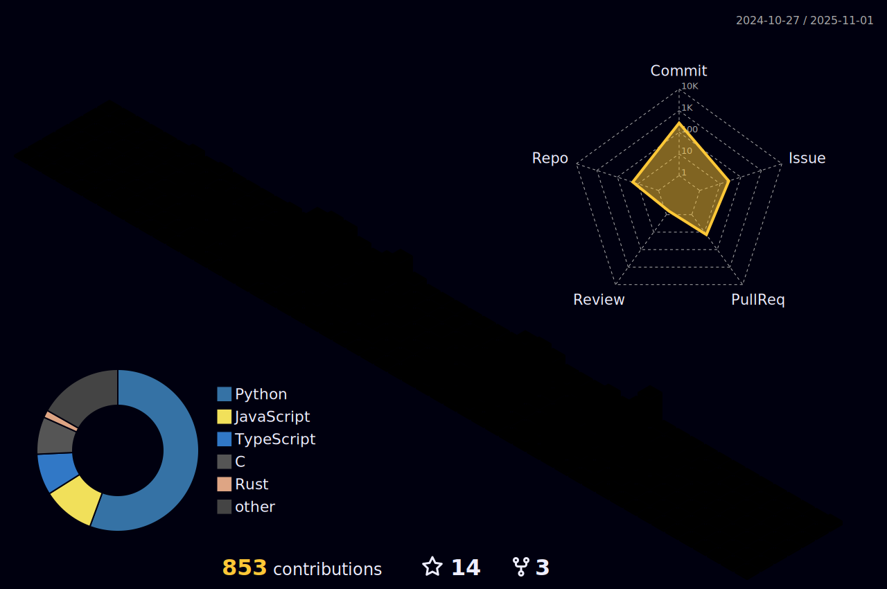

<h1 align="center">
Hi, I'm Sasutski!
  </h1>
  
<br/>


<p align="center">
  <a href="https://github.com/Sasutski/readme-typing-svg"></a>
</p>


<hr>

```
sasutski@github
-------------------------
💻 I am a self taught Full Stack Developer and a Machine Learning Developer
👨🏽‍💻 Check out my website at ""
📚 I am still studying!
📝 I have a strong interest in Data Science and Artificial Intelligence
🔭 Working on Personal Projects
🌟 Main languages: Python, JavaScript
```
<hr>


## 🛠️ My Favorite Tools

### 👨‍💻 Programming Languages

<p>
    <a href="https://github.com/search?q=user%3ADenverCoder1+is%3Arepo+language%3Ahtml"></a>
    <a href="https://github.com/search?q=user%3ADenverCoder1+is%3Arepo+language%3Acss"></a>
    <a href="https://github.com/search?q=user%3ADenverCoder1+is%3Arepo+language%3Ajavascript"></a>
    <a href="https://github.com/search?q=user%3ADenverCoder1+is%3Arepo+language%3Apython"></a>

### 🗄️ Databases and Cloud Hosting

<p>
    <a href="#"></a>
    <a href="#"></a>
</p>

### 💻 Software and Tools

<p>
    <a href="#"></a>
    <a href="#"></a>
    <a href="#"></a>
    <a href="#"></a>
    <a href="#"></a>
    <a href="#"></a>
    <a href="#"></a>
</p>

### 👨🏽‍💻 Workspace
<p>
    <a href="#"></a>
    <a href="#"></a>
</p>


## GitHub Stats


|                                                                     Sasutski's Stats                                                                     |
|:------------------------------------------------------------------------------------------------------------------------------------------------------:|
|               | 
|                     | 
|  |
    

|                                                                                                      Sasutski's Stars                                                                                                       |                                                           Top Languages                                                           |      
|:-------------------------------------------------------------------------------------------------------------------------------------------------------------------------------------------------------------------------:|:---------------------------------------------------------------------------------------------------------------------------------:|
|  |  |


<table style="border: none">
  <tr>
  <td width="50%" valign="top">


## Let's Work on Your Project Together!

If you want to work on projects together, feel free to <a href="mailto:sasutskitan@gmail.com">contact me through email</a>.


  </td>
  <td width="50%" valign="top">

## It's not perfect, isn't it?

****

“I think it’s very important to have a feedback loop, where you’re constantly thinking about what you’ve done and how you could be doing it better.”
– Elon Musk

  </td>
  </tr>
</table>

------
Credits: [I-am-vishalmaurya](https://github.com/I-am-vishalmaurya)


